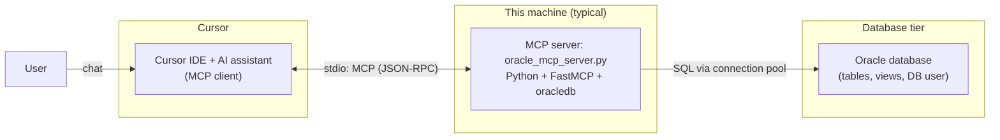
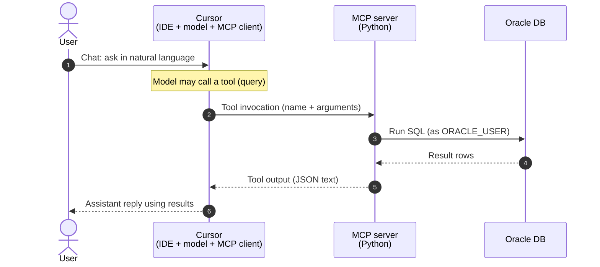
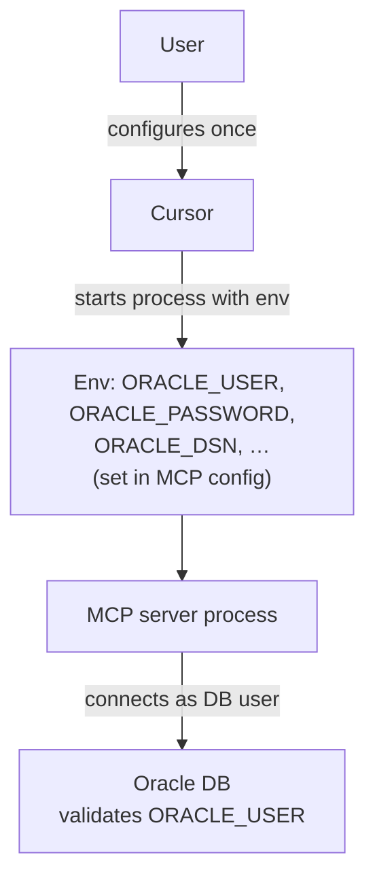

# First MCP server: Oracle (direct SQL)

This project is a **Model Context Protocol (MCP) server** written in Python. It exposes a **`query` tool** that runs **arbitrary SQL** (whatever your `ORACLE_USER` may do)—no extra helper tools, no read-only filter, and no row cap in the server. Use a **suitably limited** database account; the assistant can be destructive if it issues DML/DDL.

---

## What is MCP (in one minute)?

- **MCP** is a standard way for an application to give an AI **structured capabilities**: tools, resources, and prompts.
- Your **server** is a normal process that speaks MCP; often over **stdio** (standard input/output): the client spawns the process and exchanges JSON messages on pipes—no web server is required.
- The **user’s chat** is handled by the client and the model. The model decides **when** to call a **tool** (for example, run a SQL `SELECT`). The server runs the work and returns text (here, JSON) back to the model, which then replies to you in natural language.

So: the MCP server does **not** “listen to your chat” directly. It responds to **tool invocations** that the client sends when the assistant needs database results.

---

## Architecture (Mermaid)

The diagrams use **User** (you), **Cursor** (the IDE and its AI client), **MCP** (this Python server process), and **Oracle** (the database). Credentials for Oracle are supplied to the **MCP** process via environment variables (configured in Cursor’s MCP settings), not by sending passwords in chat.

**Preview in the editor:** Cursor and VS Code’s built-in **Markdown preview** does not render Mermaid by default; you usually only see a fenced `mermaid` code block. To see diagrams: install an extension such as [Markdown Preview Mermaid Support](https://marketplace.visualstudio.com/items?itemName=bierner.markdown-mermaid) (or similar), or open this file on **GitHub** in the browser, where Mermaid in READMEs is rendered automatically.

### Components and connections



### What happens when you ask a question



### Where the database user fits



The **Oracle** side only sees the **database account** named in `ORACLE_USER` (and the password you set in the environment). That is separate from your **Cursor** login or chat history.

---

## What this server provides

| Tool | Purpose |
|------|--------|
| `query` | One **complete** SQL (or PL/SQL) string per call; optional named `params` for binds. **No** list/describe utilities: use normal SQL, e.g. `SELECT * FROM all_tables …`. |

- **Result sets** (`cur.description` set): the server `fetchall()`s—**no row cap**; huge queries can use a lot of memory and token budget.
- **No result set** (DML/DDL, etc.): response includes `affected_rows` / `rowcount` where the driver provides them, then the connection is **committed** (non-`SELECT` path).

There is **no** SQL type whitelist in the server. Treat the DB user and chat context as a **privileged remote SQL session**.

---

## Requirements

- **Python 3.10+**
- An Oracle database you can connect to. The DB user you configure should match how much power you are willing to give the assistant (read-only is safer; full access is allowed by this code).

**Driver:** this project uses [python-oracledb](https://python-oracledb.readthedocs.io/) (`oracledb` on PyPI).

- **Thin mode (default in this project):** no Oracle Instant Client; use an **Easy Connect** DSN: `host:port/service_name`.
- **Thick mode (optional):** for **TNS names** and `tnsnames.ora`, set `ORACLE_USE_THICK=1`, install **Oracle Instant Client**, set `TNS_ADMIN` to the directory containing `tnsnames.ora`, and set `ORACLE_DSN` to the **TNS alias**. See the environment table below.

---

## Setup

### 1. Create a virtual environment and install dependencies

```powershell
cd c:\PVMEHTA\Github\Pares11804\firstmcp
python -m venv .venv
.\.venv\Scripts\Activate.ps1
pip install -r requirements.txt
```

### 2. Set environment variables

| Variable | Required | Description |
|----------|----------|-------------|
| `ORACLE_USER` | Yes | Database username. |
| `ORACLE_PASSWORD` | Yes | Password for that user. |
| `ORACLE_DSN` | Yes | **Thin:** `hostname:port/service_name` (Easy Connect). **Thick:** TNS **alias** if using `tnsnames.ora`. |
| `ORACLE_USE_THICK` | No | Set to `1` / `true` / `yes` to use Instant Client and thick mode. |
| `TNS_ADMIN` | No* | *Directory* containing `tnsnames.ora` (required for TNS resolution with Net). Often set in the system environment, not only in the app. |
| `ORACLE_CLIENT_LIB_DIR` | No | Path to Instant Client for `oracledb.init_oracle_client()` if the client is not on `PATH`. |
| `ORACLE_POOL_MAX` | No | Max pool size (default `4`). |

Never commit real passwords. You can keep them in a local **`.env`** in the project root (gitignored); the server runs `load_dotenv()` on startup. With **python-dotenv**, values **already in the process environment** (for example from Cursor’s MCP `env` block) are **not** replaced by `.env` unless you change that—so you can use **either** `.env` **or** MCP `env` for a given variable, with MCP usually winning if both are set in different places.

### 3. Register the server in Cursor

In Cursor, add an MCP server that runs this script with your venv’s Python. Conceptually you need:

- **Command:** path to `python.exe` inside `.venv`
- **Arguments:** full path to `oracle_mcp_server.py`
- **Environment:** the `ORACLE_*` variables (and `TNS_ADMIN` if using TNS files)

The exact file for MCP settings depends on your Cursor version (user-level MCP config or project-level). After saving, **reload** MCP or restart Cursor so the new server appears.

### 4. Use it in chat

- Enable the Oracle MCP in your session.
- Ask in natural language, or provide SQL. The model should call the **`query`** tool with the SQL (and `params` for binds) and then summarize the JSON.
- For metadata, the model can `query` e.g. `SELECT … FROM all_tables` / `all_tab_columns` (subject to that user’s grants).

If the model does not call the tool, say explicitly: “Use the Oracle MCP `query` tool to run: …”

---

## How the code is organized

- **`oracle_mcp_server.py`**
  - **`FastMCP`**: app name, single **`query`** tool, **stdio** transport.
  - **`get_pool()`**: lazy connection pool, thick vs thin per env.
  - **`_run_sql()`**: `execute` → if `description`: `fetchall()` + JSON; else `commit` + `rowcount` JSON.
  - `_cell_for_json` / `_rows_to_json`: encode values for the model.

- **`requirements.txt`**: `fastmcp` and `oracledb`.

---

## Security notes

- The server is effectively a **remote SQL session** for `ORACLE_USER`. Prefer a **read-only** or **least-privilege** user unless you accept DML/DDL risk from model mistakes.
- Large **SELECT**s have **no** server-side row limit; control size in SQL (e.g. `FETCH FIRST`, `ROWNUM` / `OFFSET … FETCH` as appropriate) or the session may OOM the MCP process.
- Do not **paste secrets** into chat. Configure credentials via **env** or **`.env`**.

---

## Troubleshooting

| Symptom | Things to check |
|--------|------------------|
| “Set ORACLE_USER…” | `ORACLE_USER` / `ORACLE_PASSWORD` / `ORACLE_DSN` missing in the **MCP** env, not just your shell. |
| DPI / Instant Client errors | For thick mode: Instant Client **bitness** matches Python; `TNS_ADMIN` points at the folder with `tnsnames.ora`; `ORACLE_DSN` is the **alias** name. |
| `ORA-12154` / TNS | TNS name not resolved: verify `TNS_ADMIN`, file name `tnsnames.ora`, and the alias in `ORACLE_DSN`. |
| Permission errors on `ALL_*` views | Grant `SELECT` on data dictionary / objects as needed, or query `user_*` views for the same user’s objects. |

---

## Local sanity check (optional)

With env vars set in your shell:

```powershell
$env:ORACLE_USER = "…"
$env:ORACLE_PASSWORD = "…"
$env:ORACLE_DSN = "host:1521/orcl"   # example thin DSN
python oracle_mcp_server.py
```

If the process starts and blocks on stdio, that is expected: **Cursor** is the client that will attach to it. For a quick **DB** test, use a one-off script with `oracledb.connect` and `SELECT 1 FROM DUAL` before relying on MCP.

---

## License

Add a license if you share this repository; none is set by this README by default.
